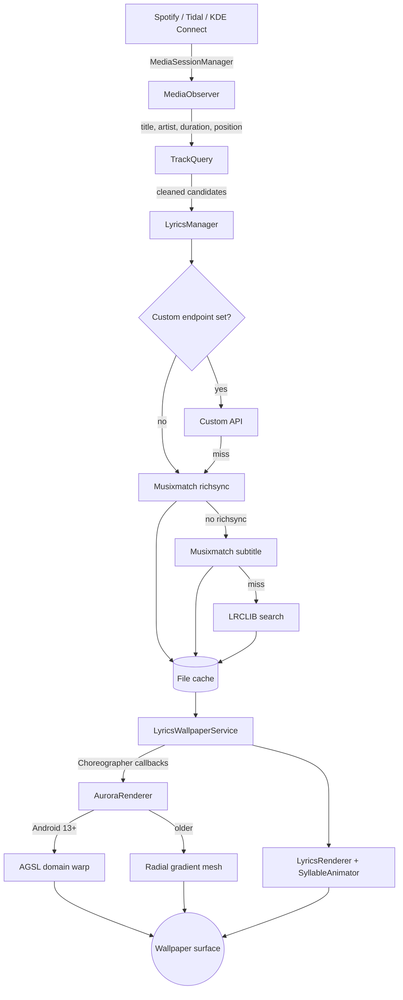

# Wallpaper Lyrics

An Android live wallpaper that shows the lyrics of whatever you are playing, in time with the music, over a background painted from the album art.

[](https://github.com/dankouwu/wallpaper-lyrics/actions/workflows/build.yml)
[](#install)
[](LICENSE)

<!--
No screenshots committed yet. Capture with:
  adb exec-out screencap -p > docs/screenshots/home.png
Wanted: home screen with lyrics, the metadata view on wake, background settings,
the idle screen. Add them here rather than shipping broken image tags.
-->

## What it is

A wallpaper, not an app you sit in. The launcher icon opens settings and nothing else. Start something in Spotify, Tidal or KDE Connect, go back to the home screen, and the lyrics are already there and already scrolling.

Where the timing data allows it, words light up one at a time instead of whole lines. Musixmatch publishes per word timing for a good part of the catalogue. When a track has none, it falls back to line timing from LRCLIB, which is most tracks.

## The background

The cover art is scaled to 512px, tinted along its own luminance, blurred, and handed to an AGSL shader that warps it with two octaves of simplex noise at 0.22 and 0.25 frequency. It ends up moving like liquid and holding the record's palette without ever looking like the record.

That path needs Android 13, which is where AGSL lands. Android 8 through 12 get animated radial gradient meshes built from a palette sampled off the same artwork. It is a visible downgrade, not a subtle one.

## What else it does

- Waking the screen shows the lyrics first, then fades in the album art with the title and artist, then goes back to the lyrics.
- Sync offset from -1000 ms to +1000 ms, plus per song offsets that stick to the track, plus Bluetooth output latency measured and subtracted automatically.
- Lyrics you can edit by hand. Paste LRC for the current track when every source has it wrong, or purge the cache and refetch.
- A custom lyrics endpoint, tried ahead of Musixmatch and LRCLIB, if you run your own.
- An idle screen with its own title and four color palette for when nothing is playing.
- Static mode, which keeps the blurred artwork and drops the animation when you want the battery back.
- Optional playback controls in the status bar, and optional Material You highlight colors.

Lyrics land in a file cache, and a miss is remembered for 24 hours so an instrumental stops hitting the network every time it comes round.

## Install

Release APKs are on the [Releases](https://github.com/dankouwu/wallpaper-lyrics/releases) page.

```bash
adb install -r wallpaper-lyrics-v1.5.0.apk
```

Then open the app, tap **Activate Live Wallpaper**, and pick **Lyrics Wallpaper** in the system picker.

> [!WARNING]
> Builds are signed with the Android debug key. That is fine for sideloading and it is the only way this ships, but the signature is not stable across builds, so an update may want an uninstall first. Releases before 1.5.0 were debug builds and are not worth installing.

## Setup

Three system settings decide whether this works at all.

> [!IMPORTANT]
> **Notification access.** Playback position and track metadata come through a `NotificationListenerService`. Without the grant there is no track, so there are no lyrics. The settings screen links straight to it.

> [!WARNING]
> **Spotify.** Turn on *Device Broadcast Status* inside Spotify's own settings. Spotify withholds most media session metadata until you do, and the wallpaper sees an empty session.

> [!TIP]
> **Battery.** Set Wallpaper Lyrics to **Unrestricted**. Android throttles background work hard, and a throttled wallpaper drops frames and stops fetching lyrics halfway through a track.

## How it works



Two details carry most of the sync quality. Position is extrapolated with `SystemClock.elapsedRealtime()` against the last metadata update, so lyrics keep moving between session callbacks instead of stepping once a second. And `TrackQuery` strips what players put in titles, the `(Official Video)` and `[Remastered 2011]` of it, then scores each candidate against the track duration before accepting a match, because a title and artist that match perfectly with a duration 30 seconds off is usually a live version.

## Build

JDK 17 and an Android SDK with API 34.

```bash
export ANDROID_HOME=~/Android/Sdk
export JAVA_HOME=/usr/lib/jvm/java-17-openjdk

./gradlew assembleDebug        # app/build/outputs/apk/debug/app-debug.apk
./gradlew testDebugUnitTest
```

The unit tests cover the parts with no Android in them: LRC parsing, query cleanup and scoring, transition and frame timing, layout maths. Shader output and the wallpaper lifecycle are not covered and need a device.

> [!NOTE]
> Gradle refuses to configure if `ANDROID_HOME` and `ANDROID_SDK_ROOT` are both set to different paths. Unset one.

## Known limitations

- Word level timing depends on Musixmatch richsync coverage. Plenty of tracks only have line timing, and some have nothing.
- The fluid background needs Android 13. Below that it is gradient meshes.
- Only Spotify, Tidal and KDE Connect sessions are picked up. Other players are ignored even when they publish a session.
- Both lyrics sources are third party and unofficial. They go down, they rate limit, and they hand back the wrong track often enough that manual LRC editing exists.
- Debug signed, so sideload only.
- No screenshots in the repo yet.

## License

[Apache 2.0](LICENSE). Copyright 2026 Daniel Hrehor.

Lyrics come from [LRCLIB](https://lrclib.net) and Musixmatch. Neither is affiliated with this project.
